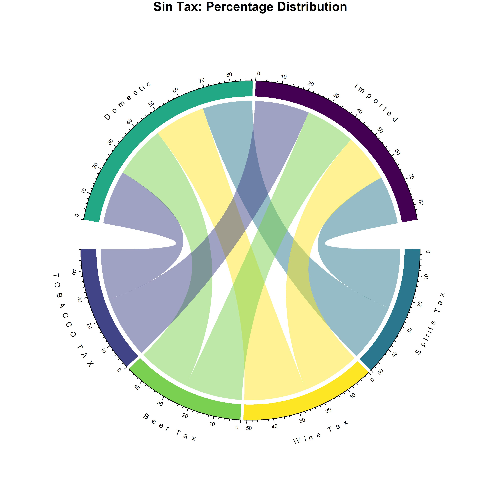

```{r setup, include=FALSE}
knitr::opts_chunk$set(
	echo = TRUE,
	message = FALSE,
	warning = FALSE
)
```

```{r Libraries and Files, message=FALSE, warning=FALSE, include=FALSE}
library(tidyverse)
library(viridis)
library(patchwork)
library(hrbrthemes)
library(circlize)
library(chorddiag)
library(wesanderson)

tax.Data <- read.csv("raw.Data/taxes.NYC.csv")

sin.Tax <- read.csv("raw.Data/sin.Tax.csv")

```

```{r Exploration, message=FALSE, warning=FALSE, include=FALSE}
mycolor <- viridis(6, alpha = 1, begin = 0, end = 1, option = "D")
mycolor <- mycolor[sample(1:6)]

sin.Tax <- sin.Tax %>%
  summarise(Revenue.Source,
            Source,
            First.Quarter = (First.Quarter / rowSums(sin.Tax[3:6])) * 100,
            Second.Quarter = (Second.Quarter / rowSums(sin.Tax[3:6])) * 100,
            Third.Quarter = (Third.Quarter / rowSums(sin.Tax[3:6]))* 100,
            Fourth.Quarter = (Fourth.Quarter / rowSums(sin.Tax[3:6]))* 100)

sin.Tax$Revenue.Source <- ifelse(sin.Tax$Revenue.Source == "Distilled Spirits Tax", "Spirits Tax", sin.Tax$Revenue.Source)


```

```{r Vizualization, fig.height=4, fig.width=6, message=FALSE, warning=FALSE, include=FALSE}
chordDiagram(sin.Tax,
             grid.col = mycolor,
             annotationTrack = "grid",
             preAllocateTracks = 1)

circos.trackPlotRegion(track.index = 2, panel.fun = function(x, y) {
  xlim = get.cell.meta.data("xlim")
  ylim = get.cell.meta.data("ylim")
  sector.name = get.cell.meta.data("sector.index")
  
#print labels 
circos.text(mean(xlim), ylim[1]+ 2.5, sector.name, 
              facing = "bending.inside", niceFacing = TRUE, adj = c(0.5, 0.0), cex=0.7)
  
#print axis
circos.axis(h = "top", labels.cex = 0.5, major.tick.length = 0.2, 
              sector.index = sector.name, track.index = 2)
}, bg.border = NA)

title(main = "US Sin Tax: Percentage Taxed")

dev.copy(jpeg,'plot.png', width=8, height=8, units="in", res=500)
dev.off()

```

In celebration of Easter and Tomorrow Taxes day this is a tongue in cheek Plot for "Sin" tax distibutions. Done in pastel colors. Hope you enjoyed it and Happy Easter and Tax Day;)



